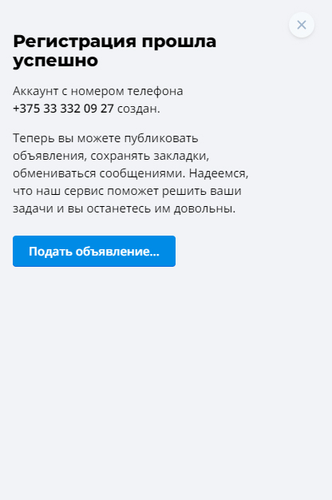
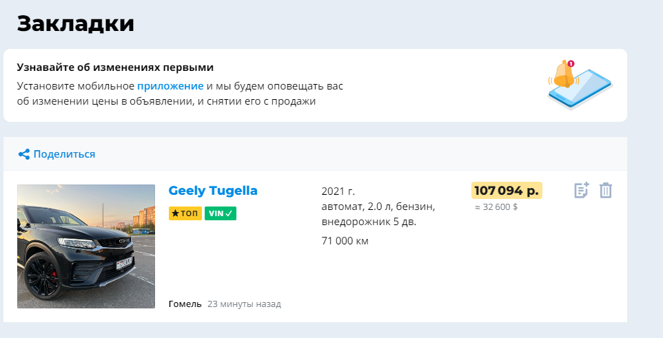

# Test Cases
## Автомобильный сайт [av.by](https://av.by/)

<strong>Test-case №1</strong>. Регистрация на сайте. 
<strong>Предусловие: </strong> для выполнения регистрации будут использоваться имя, номер телефона и пароль. 
<strong>Шаги: </strong> 
<ul>
    <li>Зайти на сайт</li>
    <li>Нажать кнопку "Войти" в хедере</li>
    <li>В выдвинутой панель нажать на кнопку "Регистрация"</li>
    <li>Ввести имя, номер телефона и пароль</li>
    <li>Принять правила обработки персональных данных</li>
    <li>Нажать кнопку "Зарегистрироваться"</li>
    <li>Дождаться код подтверждения на номер телефона</li>
    <li>Ввести код</li>
    <li>Нажать кнопку "Отправить"</li>
</ul> 
<strong>Ожидаемый результат: </strong>появление уведомления об успешной регистрации. 
<strong>Результаты: </strong>успешная регистрация 
 
<strong>Статус выполнения: </strong>выполнен успешно 

<strong>Test-case №2</strong>. Добавить автомобиль в закладки 
<strong>Предусловие: </strong> выполнить вход в аккаунт 
<strong>Шаги: </strong> 
<ul>
    <li>Зайти на сайт</li>
    <li>Найти необходимый автомобиль</li>
    <li>Кликнуть на значок "Добавить в закладки" в верхнем правом углу карточки автомобиля</li>
</ul> 
<strong>Ожидаемый результат: </strong>товар добавился в раздел "Закладки" 
<strong>Результаты: </strong>автомобиль добавлен в закладки 
 
<strong>Статус выполнения: </strong>выполнен успешно 
