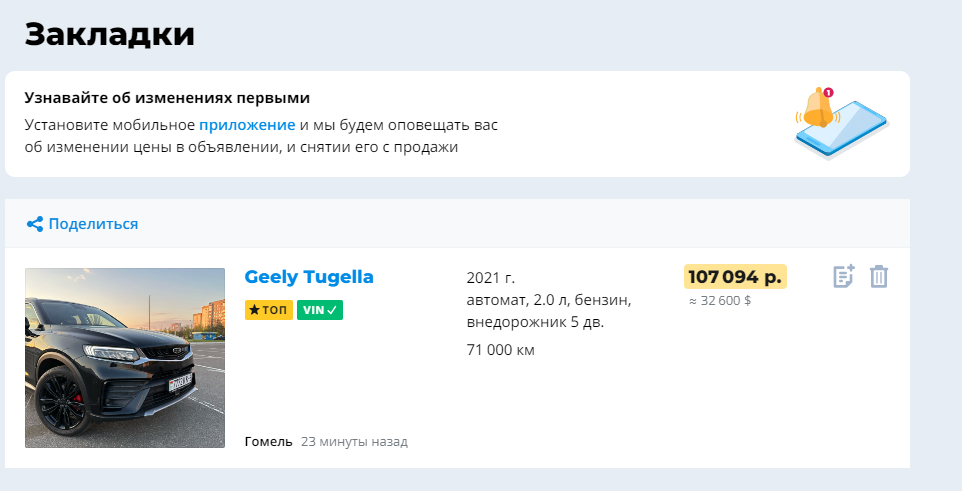
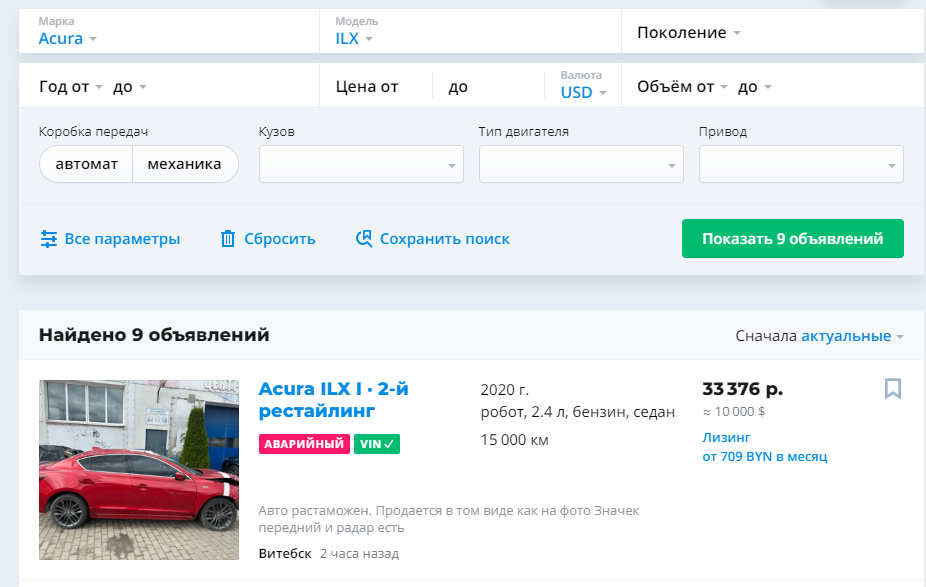
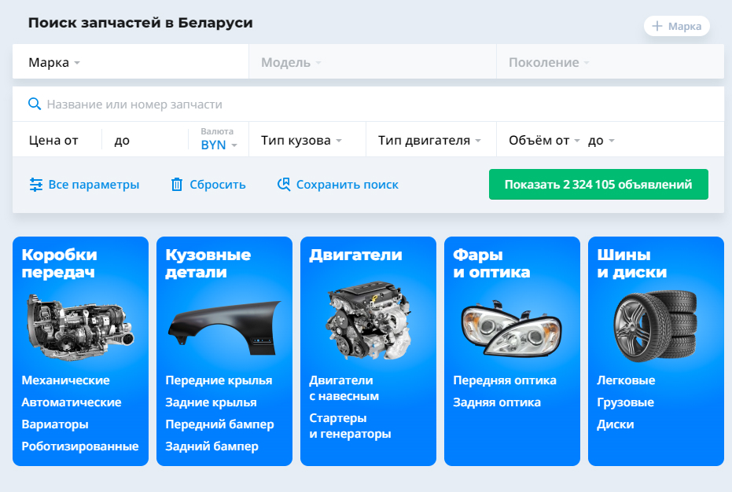
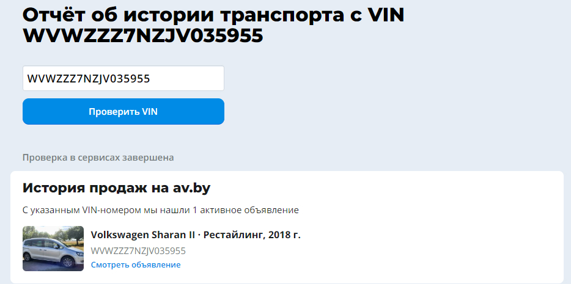
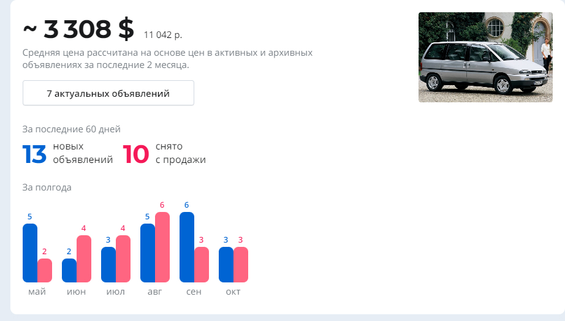
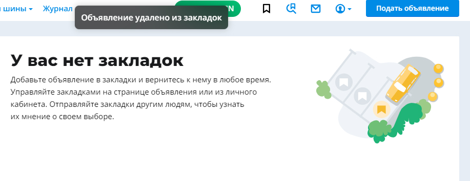
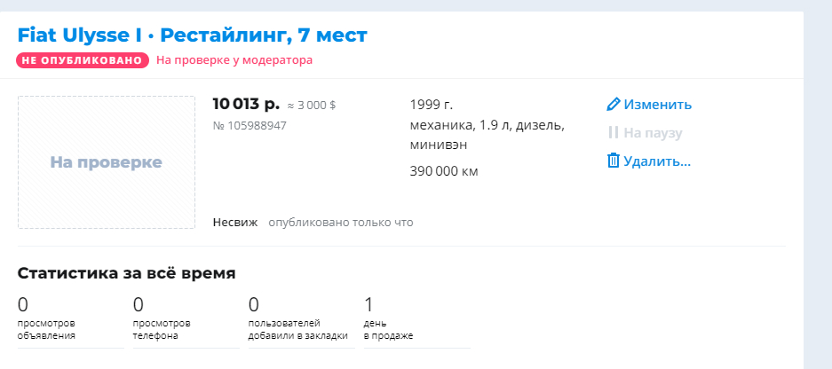
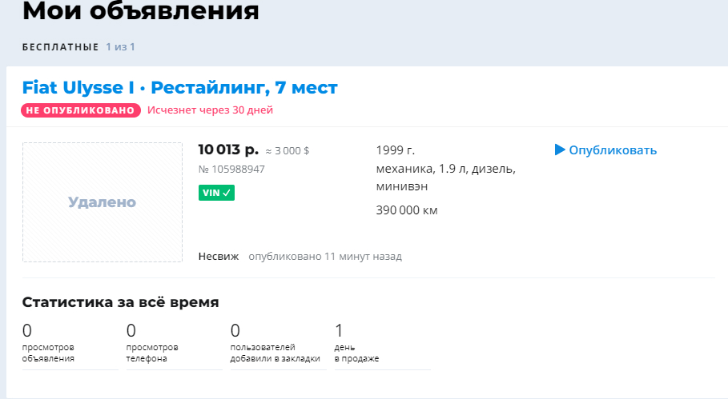
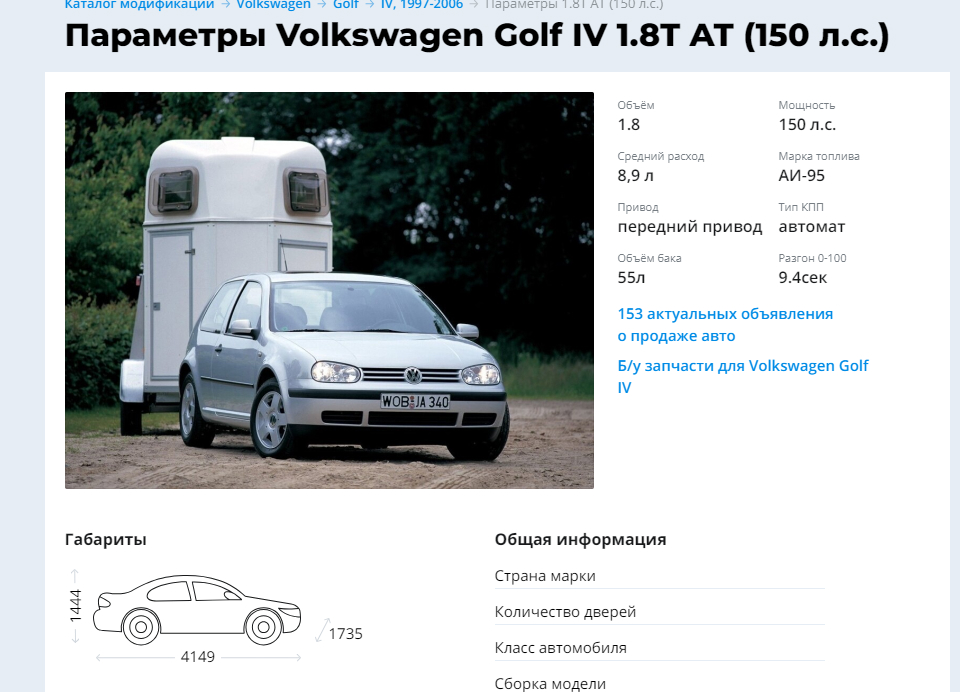

# Test Cases
## Автомобильный сайт [av.by](https://av.by/)

<strong>Test-case №1</strong>. Регистрация на сайте. 
<strong>Предусловие: </strong> для выполнения регистрации будут использоваться имя, номер телефона и пароль. 
<strong>Шаги: </strong> 
<ul>
    <li>Зайти на сайт</li>
    <li>Нажать кнопку "Войти" в хедере</li>
    <li>В выдвинутой панель нажать на кнопку "Регистрация"</li>
    <li>Ввести имя, номер телефона и пароль</li>
    <li>Принять правила обработки персональных данных</li>
    <li>Нажать кнопку "Зарегистрироваться"</li>
    <li>Дождаться код подтверждения на номер телефона</li>
    <li>Ввести код</li>
    <li>Нажать кнопку "Отправить"</li>
</ul> 
<strong>Ожидаемый результат: </strong>появление уведомления об успешной регистрации. 
<strong>Результаты: </strong>успешная регистрация 
 
<strong>Статус выполнения: </strong>выполнен успешно 

<strong>Test-case №2</strong>. Добавить автомобиль в закладки 
<strong>Предусловие: </strong> выполнить вход в аккаунт 
<strong>Шаги: </strong> 
<ul>
    <li>Зайти на сайт</li>
    <li>Найти необходимый автомобиль</li>
    <li>Кликнуть на значок "Добавить в закладки" в верхнем правом углу карточки автомобиля</li>
</ul> 
<strong>Ожидаемый результат: </strong>товар добавился в раздел "Закладки" 
<strong>Результаты: </strong>автомобиль добавлен в закладки 
 
<strong>Статус выполнения: </strong>выполнен успешно 

<strong>Test-case №3</strong>. Поиск автомобиля по параметрам 
<strong>Предусловие: </strong> нет 
<strong>Шаги: </strong> 
<ul>
    <li>Зайти на сайт</li>
    <li>Выбрать необходимые параметры поиска</li>
    <li>Нажать кнопку "Показать"</li>
</ul> 
<strong>Ожидаемый результат: </strong>список автомобилей соответвующие параметрам 
<strong>Результаты: </strong>автомобили отобразились корректно 
 
<strong>Статус выполнения: </strong>выполнен успешно 

<strong>Test-case №4</strong>. Переход на вкладку "Запчасти и шины" 
<strong>Предусловие: </strong> нет 
<strong>Шаги: </strong> 
<ul>
    <li>Зайти на сайт</li>
    <li>Выбрать пункт в навигационном меню "Запчасти и шины"</li>
</ul> 
<strong>Ожидаемый результат: </strong>отктытие страницы с щапчастями  и шинами 
<strong>Результаты: </strong>ожидаемые 
 
<strong>Статус выполнения: </strong>выполнен успешно 

<strong>Test-case №5</strong>. Проверка автомобиля по VIN 
<strong>Предусловие: </strong> нет 
<strong>Шаги: </strong> 
<ul>
    <li>Зайти на сайт</li>
    <li>Выбрать автомобиль</li>
    <li>Выбрать "Купить полный отчёт"</li>
    <li>Выбрать "Проверить VIN"</li>
</ul> 
<strong>Ожидаемый результат: </strong>информация об автомобиле 
<strong>Результаты: </strong>информация автомобиля 
 
<strong>Статус выполнения: </strong>выполнен успешно 

<strong>Test-case №6</strong>. Проверка функции оценки автомобиля 
<strong>Предусловие: </strong> информация по автомобилю используемого для оценки 
<strong>Шаги: </strong> 
<ul>
    <li>Зайти на сайт</li>
    <li>Навести курсор на пункт "Транспорт" в навигационном меню</li>
    <li>Выбрать пункт "Оценка стоимости автомобиля"</li>
    <li>Выбрать марку автомобиля</li>
    <li>Выбрать модель автомобиля</li>
    <li>Выбрать год выпуска автомобиля</li>
    <li>Выбрать поколение автомобиля</li>
</ul> 
<strong>Ожидаемый результат: </strong>Вывод оценочной стоимости 
<strong>Результаты: </strong>средняя цена на автомобиль из объявлений 
 
<strong>Статус выполнения: </strong>выполнен успешно 

<strong>Test-case №7</strong>. Удаление автомобиля из закладок 
<strong>Предусловие: </strong> зайти в аккаунт 
<strong>Шаги: </strong> 
<ul>
    <li>Зайти на сайт</li>
    <li>Перейти на вкладку "Закладки"</li>
    <li>Кликнуть на иконку мусорного бака в карточке автомобиля </li>
</ul> 
<strong>Ожидаемый результат: </strong>автомобиль удалится из закладок 
<strong>Результаты: </strong>так и случилось 
 
<strong>Статус выполнения: </strong>выполнен успешно 

<strong>Test-case №8</strong>. Подать объявление по продажи автомобиля 
<strong>Предусловие: </strong> зайти в аккаунт и знать информацию об автомобиле 
<strong>Шаги: </strong> 
<ul>
    <li>Зайти на сайт</li>
    <li>Перейти на вкладку "Подать объявление"</li>
    <li>Выбрать тип автомобиля</li>
    <li>Выбрать марку автомобиля</li>
    <li>Выбрать модель автомобиля</li>
    <li>Выбрать год выпуска автомобиля</li>
    <li>Выбрать параметры автомобиля</li>
    <li>Кликнуть "Далее"</li>
    <li>Ввести VIN-номер</li>
    <li>Ввести состояние и цвет</li>
    <li>Выбрать комплектацию</li>
    <li>Ввести информацию о регистрации</li>
    <li>Добавить фото или видео(опцианально)</li>
    <li>Ввести цену и описание, личную информацию</li>
    <li>Опубликовать</li>
</ul> 
<strong>Ожидаемый результат: </strong>объявление опубликовано 
<strong>Результаты: </strong>объявление отправлено на модерацию 
 
<strong>Статус выполнения: </strong>выполнен частично 

<strong>Test-case №9</strong>. Удалить объявление по продажи автомобиля 
<strong>Предусловие: </strong> зайти в аккаунт 
<strong>Шаги: </strong> 
<ul>
    <li>Зайти на сайт</li>
    <li>Перейти на вкладку "Мои объявления"</li>
    <li>Кликнуть "Удалить"</li>
    <li>Указать причину удаления</li>
</ul> 
<strong>Ожидаемый результат: </strong>объявление удалено 
<strong>Результаты: </strong>объявление не опубликовано, но будет удалено через 30 дней 
 
<strong>Статус выполнения: </strong>выполнен частично 

<strong>Test-case №10</strong>. Проверка каталога модификаций 
<strong>Предусловие: </strong> нету 
<strong>Шаги: </strong> 
<ul>
    <li>Зайти на сайт</li>
    <li>Перейти на вкладку "Каталог модификаций"</li>
    <li>Выбрать марку автомобиля</li>
    <li>Выбрать модель автомобиля</li>
    <li>Выбрать конфигурацию автомобиля</li>
</ul> 
<strong>Ожидаемый результат: </strong>вывод полной информацию по автомобилю 
<strong>Результаты: </strong>вывелась полна информация по автомобилю 
 
<strong>Статус выполнения: </strong>выполнен успешно 

